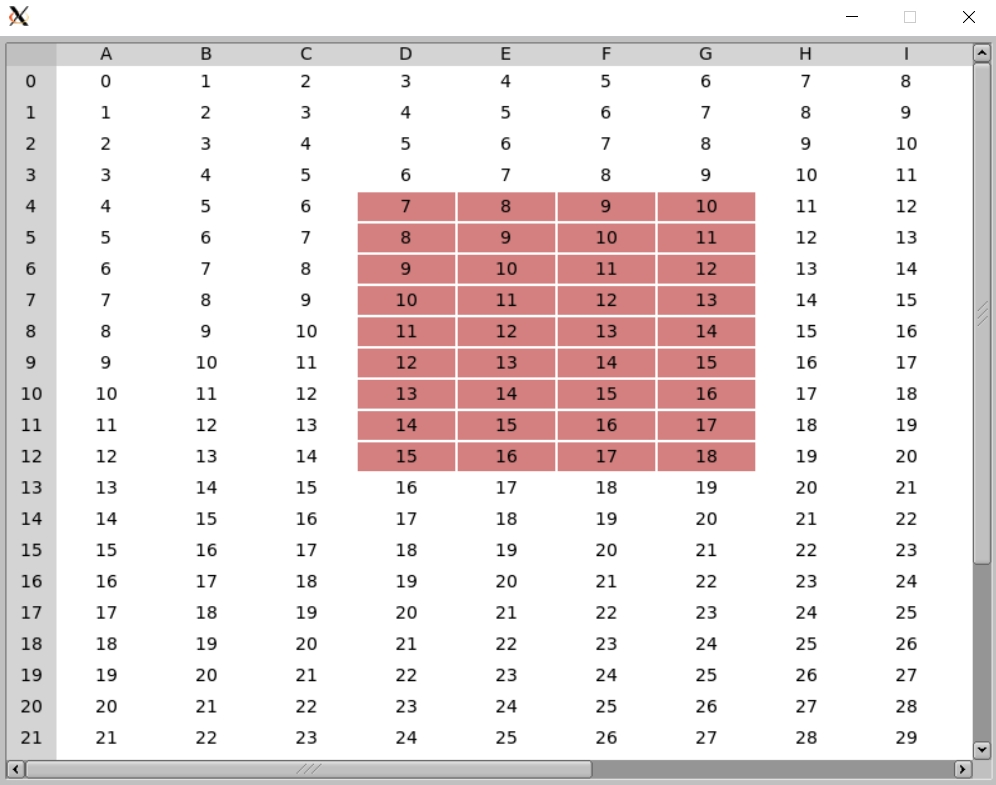

# fltk-table

A smart table widget for fltk-rs. It aims to reduce the amount of boilerplate required to create a table. 

## Usage
```toml
[dependencies]
fltk = "1.2"
fltk-table = "0.1"
```

## Example
```rust
use fltk::{
    app, enums,
    prelude::{GroupExt, WidgetExt},
    window,
};
use fltk_table::{SmartTable, TableOpts};

fn main() {
    let app = app::App::default().with_scheme(app::Scheme::Gtk);
    let mut wind = window::Window::default().with_size(800, 600);

    /// We pass the rows and columns thru the TableOpts field
    let mut table = SmartTable::default(TableOpts {
        rows: 30,
        cols: 15,
        ..Default::default()
    })
    .with_size(790, 590)
    .center_of_parent();
    
    // the default is false
    table.editable(true);

    wind.end();
    wind.show();

    // Just filling the vec with some values
    for i in 0..30 {
        for j in 0..15 {
            table.set_cell_value(i, j, &(i + j).to_string());
        }
    }

    // set the value at the row,column 4,5 to "another", notice that indices start at 0
    table.set_cell_value(3, 4, "another");

    assert_eq!(table.cell_value(3, 4), "another");

    // To avoid closing the window on hitting the escape key
    wind.set_callback(move |_| {
        if app::event() == enums::Event::Close {
            app.quit();
        }
    });

    app.run().unwrap();
}
```
You can retrieve a copy of the data using the `SmartTable::data()` method.

The TableOpts struct also takes styling elements for cells and headers:
```rust
let mut table = SmartTable::default(TableOpts {
        rows: 30,
        cols: 15,
        cell_selection_color: Color::Red.inactive(),
        header_frame: FrameType::FlatBox,
        header_color: Color::BackGround.lighter(),
        cell_border_color: Color::White,
        ..Default::default()
    });
```



The row/column header strings can also be changed using the `set_row_header_value()` and `set_col_header_value()` methods, which take an index to the required row/column. 